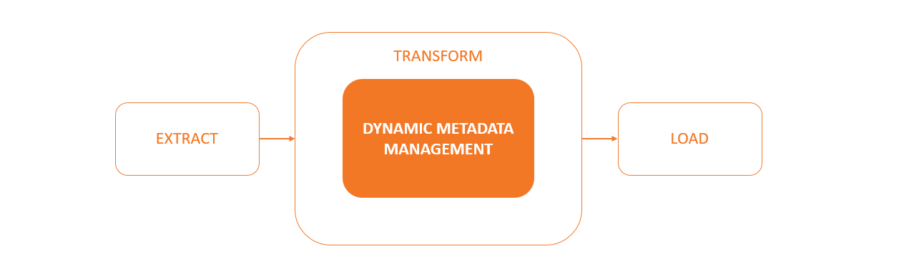
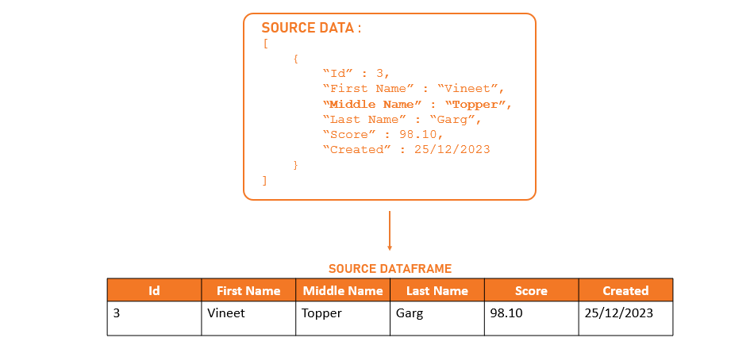
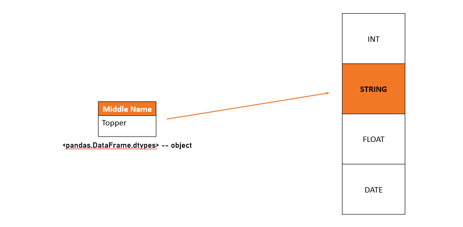
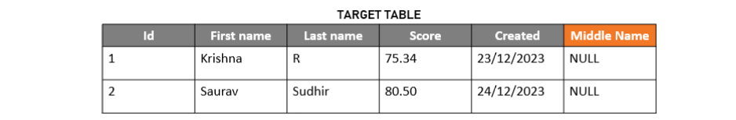
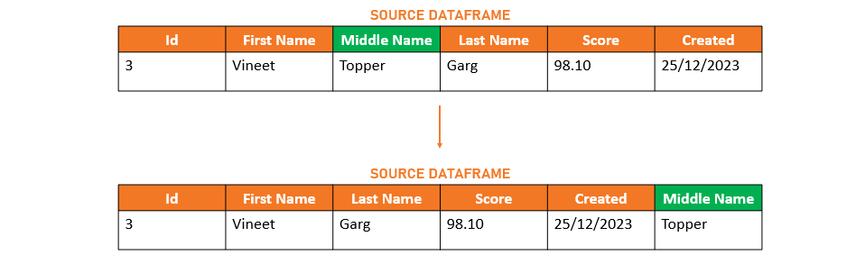
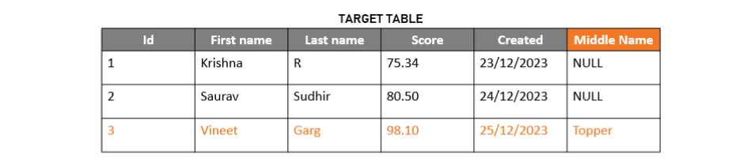
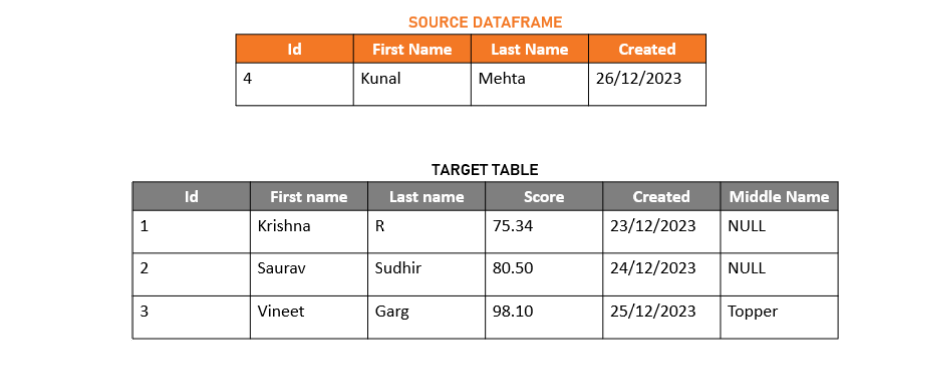
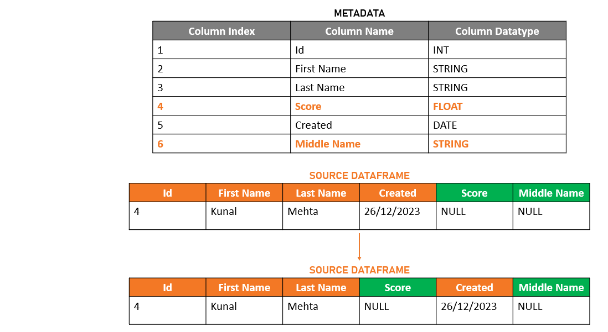
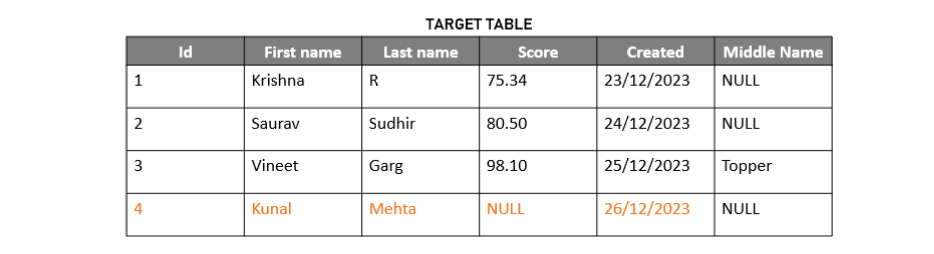

# Dynamic Metadata Management
Built for data engineers and developers, Dynamic Metadata Management is a plug-in that was created in Python that allows them to add the following functionalities to their data pipelines:
1. Auto capture of additional/missing source data keys/columns.
2. Table structure and data format handling.
4. Proactively identify, avoid and handle job failures due to metadata changes.
5. Applicable across structure & semi-structure data set
6. Open-source code, customizable for cloud agnostic platform.

## Index
- [Overview](README.md#Overview)
  - [Technologies Used](README.md#Technologies-Used)
  - [Pre-requisites](README.md#Pre-requisites)
  - [How it works](README.md#How-it-works)
- [Code in Depth](README.md#Code-in-Depth)
- [Tests](README.md#Tests)
- [Credits](README.md#Credits)

## Overview
In an ETL process, the plugin will be placed inside the transform section of the pipeline. Once data has been extracted from source and converted to a <pandas.DataFrame>, it will be then fed into the plug-in along with target table metadata. The plug-in will then carry out any required adjustments prior to supplying dataframe to the load task.
    

The DMM framework will significantly reduce development time for ingestion activities. It will assist in avoiding any additional work required to alter tables, configuration files, metadata, tedious email chains, pipeline testing, and repetition of the same steps for production. Developers may now dedicate their time on useful pipeline design and construction, data extraction from new sources, and dataset expansion for analysts to produce fresh insights instead of spending that time on a task that has less impact but requires more effort. The overall level of productivity increases as developers no longer need to worry about making any adjustments owing to source-schema-related problems.
### Technologies Used
python
### Pre-requisites
The plug-in will require metadata about your target table. You will need to pass the connection for this metadata table to the DMM plug-in as a parameter. The metadata must at the very least include:
  1. column name
  2. column data type
  3. index  (order/placement of columns in target table)
  
The metadata aids in providing a clear idea of the target table's current structure. The code will then make use of this data to find new datapoints and columns in the source and change the table accordingly. It will also utilise this data to find missing records and determine what kind of null value should be filled based on the data type of the column.
### How it works
- Input : 
  ```
  - Source data converted to <pandas.DataFrame>
  - Pre-requisite metadata table connection
  - Target table connection
  - Name of the table
  ```


- Output :
  ```
  - match_columns() returns Modified pandas dataframe to be saved at destination
  ```

- Process :
  
  Addition of columns :
  
  When a new data point(s) has been fetched from source, the plug-in will compare the freshly fetched source columns with the existing metadata to detect new column(s). It will then identify their data types and alter the target table structure to add these new columns. Finally, the plug-in returns the Dataframe to be sent to the Load(Save) part of the code where the dataframe will get appended to the target table.
  
  Eg:
  A school is storing entrance exam score details in their DB. The existing target table is as follows - 
      
  
  Their data pipeline fetches new data every data. The latest data (JSON Response) fetched by the extract function is given below -
  ```
  [
    {
        “Id” : 3,
        “First Name” : “Vineet”,
        “Middle Name” : “Topper”,
        “Last Name” : “Garg”,
        “Score” : 98.10,
        “Created” : 25/12/2023
    }
  ]
  ```
  
  We can notice that the above JSON has a new data point called **'Middle Name'**. The transform job converts the JSON to <pandas.DataFrame> and passes it as a parameter to the plug-in -
    
  
  Based on the content, the dataframe assigns **'object'** as the datatype for **'Middle Name'** . Using this info, the plug-in then identifies the corresponding DB appropriate datatype (like VARCHAR(*char_length*) for MySQL), runs an alter statement - modifying the target table to add the new column.
    
    
  
  The Plug-in then returns the dataframe after re-ordering columns in their correct order. Finally, the load job appends this data to the target table.
    
    
  
  *Note - The DMM plugin also updates the metadata before returning the dataframe*
    
    
    
  Handling of Missing columns :
  
  If column(s) are missing from source dataframe, then the plug-in will identify those columns, retreive their datatypes from metadata and accordingly fill in the placeholder values before sending it to the load job.
  
  Eg: Continuing the above example, the latest data fetched now is of a student who failed to complete his exam on time and as a result didn't get a score. The JSON response fetched by the extract job is given below - 
  ```
  [
    {
        “Id” : 4,
        “First Name” : “Kunal”,
        “Last Name” : “Mehta”,
        “Created” : 26/12/2023
    }
  ]
  ```
  The current target table and source dataframe look like this - 
    
  
  The plug-in compares the columns from source dataframe and metadata to detect that **'Score'** and **'Middle Name'** are missing. It will then add the missing columns and re-order them in accordance with the 'column_index' from metadata.
    
    
  Finally, the dataframe returned by plug-in is sent to load job to be appended to the target table.
    
  

## Code in Depth
To explain how and where to use the plug-in, we have developed example extract, transform and load jobs. The plug-in has been integrated into the transform part of the code. 

There are 4 python files involved in the code section
* DMM                   - The plug-in file
* DMM_common            - support for DMM
* extract               - Helps ingest data from source
* fascade_core_adapter  - Main which helps run the enitre code
* load                  - Helps save data to target
  
### Flow of example code
  
Initialisation and Extraction :
>* The core_adpter consists of the FascadeCore class which takes in the **table name** and **config file** path as parameters. We create an object of this class to run the fascade_main() method
>```
>if __name__ =="__main__":
>    object_name = dbutils.widgets.getArgument("object_name")
>    config_path = dbutils.widgets.getArgument("config_path")
>    fascade_core = FascadeCore(str(object_name), str(config_path))
>    fascade_core.fascade_main()
>```
>* The fascade_main() function first reads configuration details from the config file mentioned in parameters. The data from config file along with credentials stored in secret vault (in our case - Azure Data Vault) will be used to connect to tables
>* fascade_main() now makes use of DataBaseConnection class from DMM_common.py to connect to :- 
>>  - configuration tables 
>>    - to fetch timestamp for incremental load
>>    - to pass the connection as a parameter to plug to fulfil the pre-requisites
>>  - target tables 
>>    - to pass the connection as parameter to plug-in as required 
>>    - to eventually pass it to Load class from load.py
>* Next the function makes use of DataExtract class from extract.py to connect and fetch data from source
>```
>#Extracting data from source
>extract_object = DataExtract(self.object_name,
>                             self.object_config,
>                             self.connection,
>                             max_system_timestamp,
>                             object[self.object_name])
>df = extract_object.get_dataframe()
>```
  
Transformation and Plug-in :
  
>* To keep things simple we are only making use of the DMM plug-in. No additional transformations will be performed.
>* The code now initialises an object of the **DynamicMM** class. And then it uses the **match_columns()** method, which takes in the source data frame as a parameter to add new columns and handle missing columns.
>```
>adaptive_class = DynamicMM(self.config_connection,
>                           self.target_connection,
>                           self.object_name,
>                           object[self.object_name]['target_database'])
>if self.object_config['adaptive_framework_flag']==True and max_system_timestamp != None:
>    df = adaptive_class.match_columns(df)
>```
>* **DynamicMM.match_columns()** prepares the target table and returns the source data dataframe for it to be saved by the load job.
  
DynamicMM PLug-in:
>* After DynamicMM class has been initialized, the method which takes care of the operations is **match_columns()**. 
>```
>_
>def match_columns(self,_table):
>    """
>    This function is to do the adaptie framework function 
>    to add new columns and adding empty string to the deleted columns
>    parameters:
>        _table (core.frame.DataFrame) : dataframe with source data
>    returns:
>        _table (core.frame.DataFrame) : dataframe with source data
>   """
>_
>```
>* match_columns() first identifies additional and missing columns. For this the plug-in uses **get_df()** method to fetch target table metadata
>```
> def get_df(self, sql , cnx):
>    """
>    This function is to return dataframe out of query result
>    parameters:
>        sql (str) : query string to return result
>        cnx (obj) : connection object
>    returns:
>        df (core.frame.DataFrame) : dataframe with source data
>    """
>    return pd.read_sql(sql,con = cnx)
>```
>* For addition of columns - First the dtype of the new columns are used to identify what the datatype of those columns should be while saving data to db/target.
>```
>for new_col in new_columns_added:
>#Added this check to validate if there are dtypes defined in the config file or gettting created in the code itself 
>                    
>                    column_data_type=str(_table.dtypes[new_col])
>                    if column_data_type in ['object']:
>                        datatype='VARCHAR(20)'
>                        data_cast='string'
>                    if column_data_type in ["int64","int32","int8"]:
>                        datatype='BIGINT'
>                        data_cast='int' 
>                    elif column_data_type in ['timestamp','datetime64[ns]','datetime','datetime64','timedelta[ns]','datetime64[ns, UTC]']:
>                        datatype='TIMESTAMP WITHOUT TIME ZONE'
>                        data_cast='timestamp'
>                    elif column_data_type in ['date']:
>                        datatype='date'
>                        data_cast='date'
>                    elif column_data_type in ['float64','double', 'currency', 'float', 'decimal','float_','float16','float32','numeric','real']:
>                        datatype='REAL'
>                        data_cast='float'
>                    elif column_data_type in ['boolean','Boolean','bool','bool_']:
>                        datatype='bool'
>                        data_cast='boolean'
>                    elif column_data_type in ['smallint','int', 'bigint','int_','int16','uint8','uint16','uint32','Int64','uint64''integer']:
>                        datatype='BIGINT'
>                        data_cast='int'                       
>                    else:
>                        datatype='VARCHAR(20)'
>                        data_cast='object'
>```
>* using **execute_sql_script()** method we alter the structure of the target table to accomodate new incoming data and update the metadata in the configuration table
>```
>def execute_sql_script(self,sql,connection):
>   """
>   this function is to execute sql script
>   parameters:
>       sql (str) : sql query string
>       connection (obj) : connection object
>   returns:
>        None
>   """
>   connection.execute(sql)
>   return None
>```
>  
>```
>_
>_sql='alter table {object_name} add column {column_name} {datatype} ;'.format(column_name=new_col,datatype=datatype,object_name = self.object_name)
>self.execute_sql_script(_sql,self.target_connection)
>logger.info("executed alter table for adding column %s", new_col)
>_
>```
>  
>```
>_
>_sql_insert="""INSERT INTO `idmm-tmt-uat-config`.`column_mapping`
>                                    (`column_id`,
>                                    `object_name`,
>                                    `column_name`,
>                                    `data_type`,
>                                    `index`,
>                                    `inserted_by`)
>                                    VALUES
>                                    ('{column_id}',
>                                    '{object_name}',
>                                    '{column_name}',
>                                    '{data_type}',
>                                    '{index}',
>                                    '{inserted_by}');"""   
>                        _id = str(uuid.uuid4())
>                        object_name = self.object_name
>                        column_name = new_col
>                        data_type = data_cast
>                        #str(df[new_col].dtype)
>                        inserted_by = 'adpative framework'
>                        
>try:
>   self.execute_sql_script(_sql_insert.format(column_id = _id, object_name = object_name, column_name = column_name, data_type = data_type, index = index, inserted_by = inserted_by), self.config_connection)
>_
>```
>  
>*For handling of missing columns - the plug-in uses **align_columns()** method to fill the missing values and then reorder the columns according to column_index mentioned in configuration table
>```
>def align_columns(self, df, deleted_column):
>   """
>   This function is to align column order based on the target table
>   parameters:
>     original_column (list) : 
>   returns:
>     _df (core.frame.DataFrame) : dataframe with source data
>   """
>```
>* At last match_columns() method returns the modified dataframe to fascade_main() so that it can be saved at target
  
Load :
>* fascade_main() now creates an object of Load class from load.py. It then makes use of the write_df() method from Load class to save the data to target.
>```
>## writing source data into target table
>save_object = Load()
>save_object.write_df(df=df,con=self.target_connection)
>```
>* After successfully saving data to the target, we update the new max_timestamp value in configuration table. Also if target table is being created for the first time then update the details in column mapping/metadata configuration table.


## Credits
> Krishna
>
> Kunal
>
> Saurav
>
> Vineet
