# Dynamic Metadata Management
Dynamic Metadata Management is a plug-in that enables users to dynamically add new columns (data points) from the source to the target table. Before storing data to the destination, it will also assist in handling missing columns. 

## Index
- [Overview](README.md#Overview)
  - [Pre-requisites](README.md#Pre-requisites)
  - [How it works](README.md#How-it-works)
- [How to run the project](README.md#How-to-run-the-project)
- [Tests](README.md#Tests)
- [Credits](README.md#Credits)

## Overview
The DMM framework will significantly reduced development time for ingestion activities. It will help to avoid any extra effort put into modifying tables, config files, metadata, tiresome email chains, testing of pipelines, and repetition of the entire same steps for prod. Developers can now save hours of their time from an activity of less impact but more effort and put into designing and building meaningful pipelines, extracting data from new sources and growing the dataset for analysts to generate new insights. Developers can now be worry free of any corrections to be made due to source related issues increasing overall productivity.
### Pre-requisites
The plug-in will require metadata about your target table. You will need to pass the connection for this metadata table to the DMM plug-in as a parameter. The metadata should at least consist of -
  1. column name
  2. column data type
  3. index  (order/placement of columns in target table)
### How it works
The metadata helps give a good understanding about the existing structure of target table. The code will then use this information to- 
- detect new datapoints/columns from source and alter the table accordingly
- detect missing records and identify what type of null value to be filled based on the column data type
#### Design
- Input : 
  ```
  - Source data converted to <pandas.DataFrame>
  - Pre-requisite metadata table connection
  - Target table connection
  - Name of the table
  ```


- Output :
  ```
  - match_columns() returns Modified pandas dataframe to be saved at destination
  ```

- Process :
  
  In an ETL process, the plugin will be placed inside the transform section. Once data has been extracted from source and converted to a <pandas.DataFrame>, it will be then fed into the plug-in along with target table metadata
    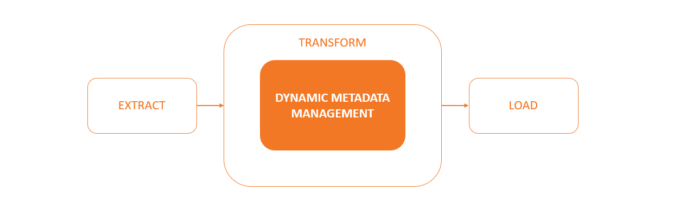
  
  Addition of columns :
  
  When a new data point(s) has been fetched from source, the plug-in will compare the freshly fetched source columns with the existing metadata to detect new column(s). It will then identify their data types and alter the target table structure to add these new columns. Finally, the plug-in returns the Dataframe to be sent to the Load(Save) part of the code where the dataframe will get appended to the target table.
  
  Eg:
  A school is storing entrance exam score details in their DB. The existing target table is as follows - 
      
  
  Their data pipeline fetches new data every data. The latest data (JSON Response) fetched by the extract function is given below -
  ```
  [
    {
        “Id” : 3,
        “First Name” : “Vineet”,
        “Middle Name” : “Topper”,
        “Last Name” : “Garg”,
        “Score” : 98.10,
        “Created” : 25/12/2023
    }
  ]
  ```
  
  We can notice that the above JSON has a new data point called **'Middle Name'**. The transform job converts the JSON to <pandas.DataFrame> and passes it as a parameter to the plug-in -
    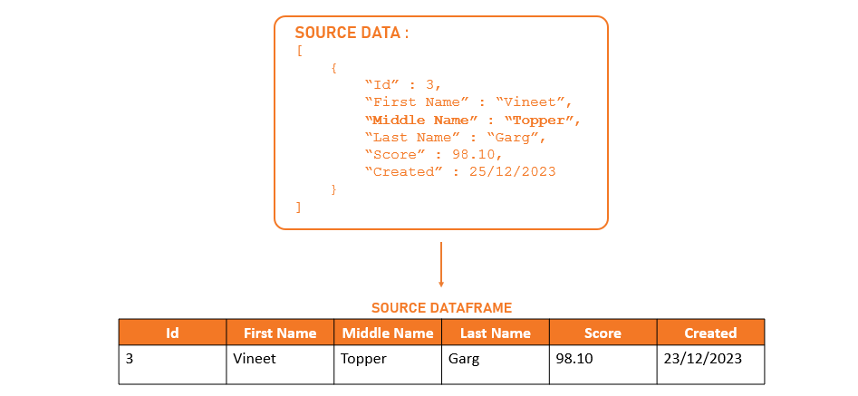
  
  Based on the content, the dataframe assigns **'object'** as the datatype for **'Middle Name'** . Using this info, the plug-in then identifies the corresponding DB appropriate datatype (like VARCHAR(*char_length*) for MySQL), runs an alter statement - modifying the target table to add the new column.
    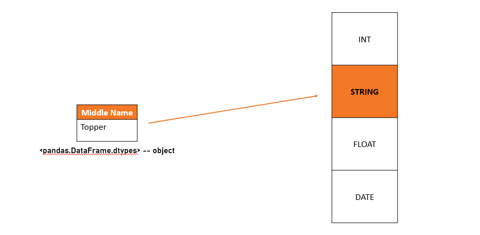
    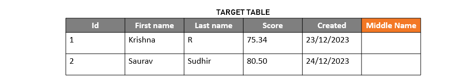
  
  The Plug-in then returns the dataframe after re-ordering columns in their correct order. Finally, the load job appends this data to the target table.
    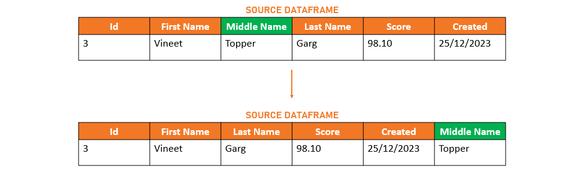
    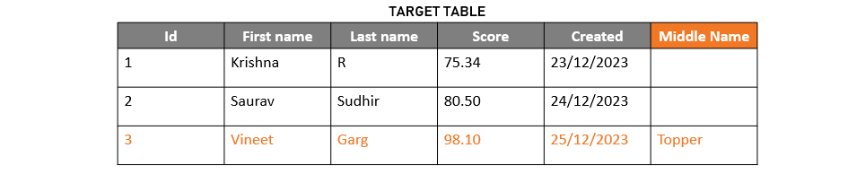
  
  *Note - The DMM plugin also updates the metadata before returning the dataframe*
    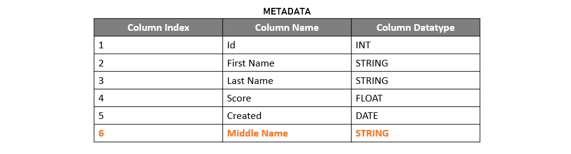
    
    
  Handling of Missing columns :
  
  If column(s) are missing from source dataframe, then the plug-in will identify those columns, retreive their datatypes from metadata and accordingly fill in the placeholder values before sending it to the load job.
  
  Eg: Continuing the above example, the latest data fetched now is of a student who failed to complete his exam on time and as a result didn't get a score. The JSON response fetched by the extract job is given below - 
  ```
  [
    {
        “Id” : 4,
        “First Name” : “Kunal”,
        “Last Name” : “Mehta”,
        “Created” : 26/12/2023
    }
  ]
  ```
  The current target table and source dataframe look like this - 
    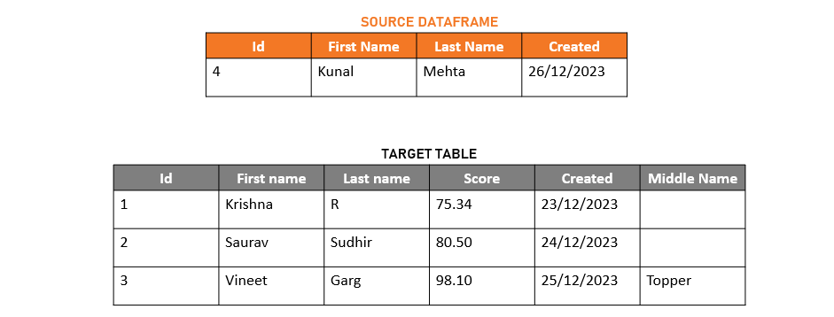
  
  The plug-in compares the columns from source dataframe and metadata to detect that **'Score'** and **'Middle Name'** are missing. It will then add the missing columns and re-order them in accordance with the 'column_index' from metadata.
      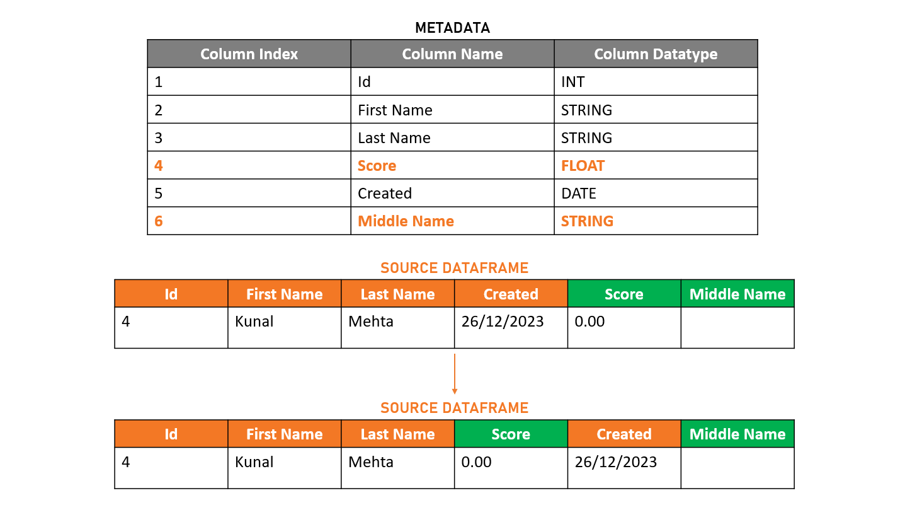
    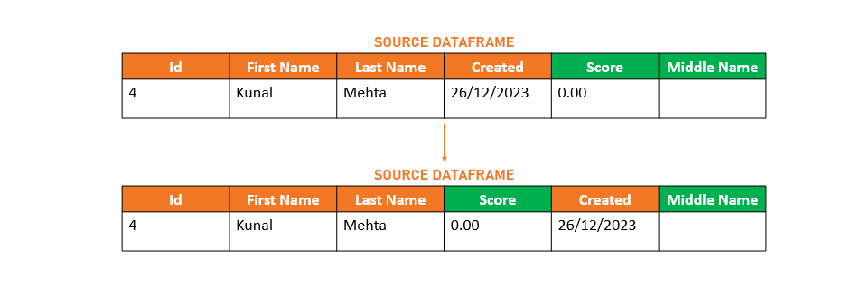
    
  Finally, the dataframe returned by plug-in is sent to load job to be appended to the target table.
    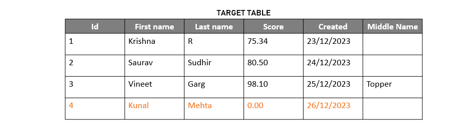
  

#### Technologies Used
JUST python :smile:

#### Challenges Faced and Features to be implemented in the future
The Adaptive Framework code was deeply integrated with the core ingestion code. So, designing a plug-in and modularization took effort and planning. Since the code was custom made for Informa, generalizing the plug-in was also a matter of concern. We had to take some hard decisions by setting some pre-requisites. We hope in the future we are able to further build on it and make it adaptible and compatible with all DBs/sources.
  
## How to run the project
How to use the plugin?

## Tests
Test cases and how to run them

## Credits
> Krishna
>
> Kunal
>
> Saurav
>
> Vineet

## License (Optional)

## Badges (Optional)

## How to conrtibute? (Optional)
